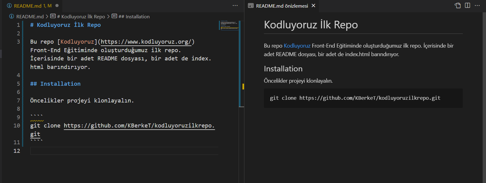

# Kodluyoruz İlk Repo

Bu repo [Kodluyoruz](https://www.kodluyoruz.org/) Front-End Eğitiminde oluşturduğumuz ilk repo. İçerisinde bir adet README dosyası, bir adet de index.html barındırıyor.



## Installation

Öncelikler projeyi klonlayalın.

```git
git clone https://github.com/KBerkeT/kodluyoruzilkrepo.git
```

## Usage

Projeyi cloneladıktan sonra Visual Studio Code programında açınız.

Linux için:

```git
cd kodluyoruzilkpro
code .
```

## Contributing

Pull requesler kabul edilir. Büyük değişiklikler için önce neyi değiştirmek istediğinizi tartışmak için konu açınız.

## License

[MIT](https://choosealicense.com/licenses/mit/)
